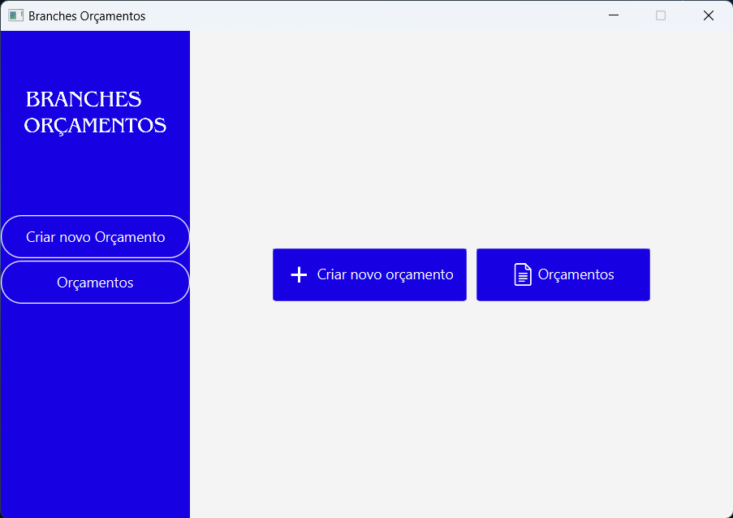
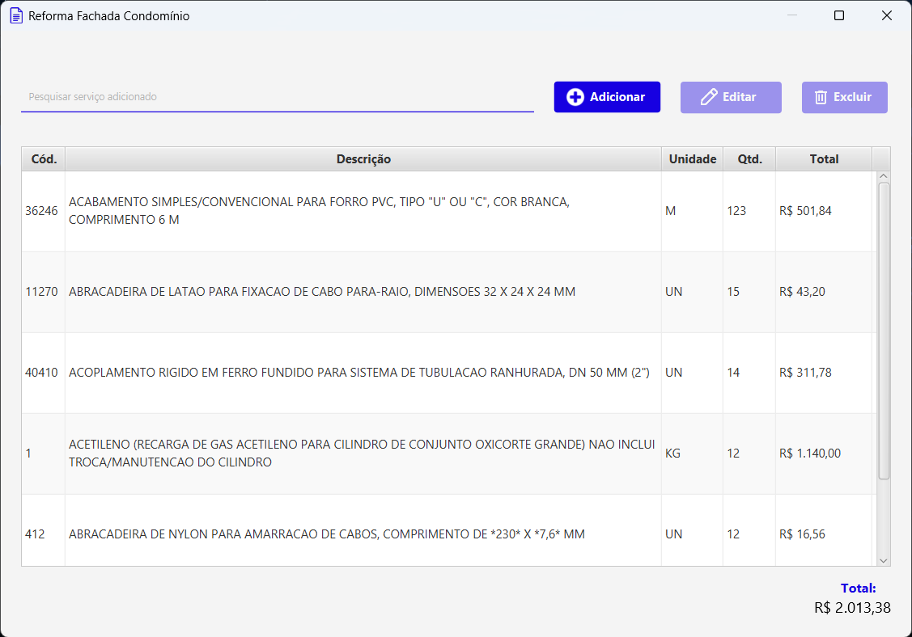
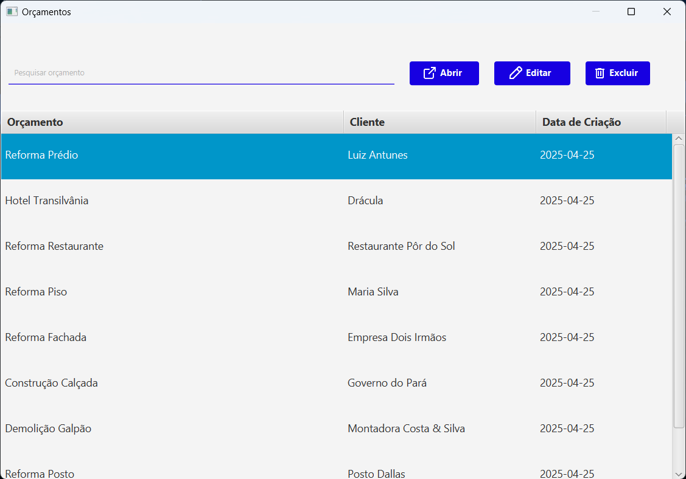
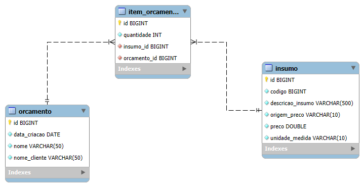

## Orçamentos Sinapi

> Sistema desktop para criação e gestão de orçamentos de insumos da construção civil, com base na tabela SINAPI.

Este repositório contém o **Backend** e o **Frontend** do projeto.

---

## 📁 Estrutura do Repositório
*  [`orcamentos-sinapi-api`](./orcamentos-sinapi-api): Módulo da API RestFul, desenvolvida com **Spring Boot**.
*  [`orcamentos-sinapi-application`](./orcamentos-sinapi-application): Front-End em **JavaFX**.
*  [`orcamentos-sinapi-script-insercao-dados`](./orcamentos-sinapi-script-insercao-dados): Script que faz requisição POST na API com insumos, lidos da tabela SINAPI, carregada em `src/main/resources/files`, e um orçamento, a fim de melhorar a experiência de quem está testando a aplicação.

---

## 🎯 Funcionalidades

* ✅ **Cadastro e Gestão de Insumos:** Permite o cadastro, edição e exclusão de insumos utilizados na construção civil, com base na tabela SINAPI.
* ✅ **Criação de Orçamentos:** Criação de orçamentos com cálculo automático do custo total, baseado nos insumos selecionados.
* ✅ **Visualização de Orçamentos:** Visualização de orçamentos com detalhes dos insumos e custos envolvidos.
---

## 🛠️ Tecnologias Utilizadas

-  - Linguagem de programação utilizada.
-  - Framework para criação de APIs REST em Java.
-  - Conteinerização da aplicação.
-  - Banco de dados utilizado para persistência de dados.
-  - Interface interativa e de fácil utilização.
-  - Gerencia dependências e automação de builds para projetos Java.

---

## 📸 Demonstração

### Interface do App Desktop
<div style="text-align: center;">
  
</div>
<div style="text-align: center;">
  
</div>
<div style="text-align: center;">
  
</div>

### Modelagem do Banco de Dados
<div style="text-align: center;">
  
</div>

---

## 🚀  Como Rodar a API

### 1. Configuração das Variáveis de Ambiente

Antes de iniciar a aplicação, é necessário configurar as variáveis de ambiente para garantir que todos os módulos funcionem corretamente.

#### a. **Variáveis Docker (`orcamentos-sinapi-api`)**
- Navegue até o diretório do módulo `orcamentos-sinapi-api`.
- Renomeie o arquivo `.envTemplate` para `.env` e preencha as variáveis com os valores apropriados para o seu ambiente de desenvolvimento.

#### b. **Variáveis Spring Boot (`src/main/resources`)**
Obs: Caso queira utilizar as credenciais predefinidas em `application.yaml`, **você pode pular essa etapa**.
- Navegue até o diretório `src/main/resources` do módulo `orcamentos-sinapi-api`.
- Renomeie o arquivo `.envTemplate` para `.env` e configure as variáveis conforme necessário para o Spring Boot.

### 2. Rodar Docker
- A partir da raíz do repositório rodar o seguinte comando:
    ```
      cd orcamentos-sinapi-api
      docker-compose up -d
    ```
  
### 3. Inicializar Spring Boot
- Da raíz do projeto rodar os seguintes comandos:
    ```
      cd orcamentos-sinapi-api
      mvn spring-boot:run
    ```

### 4. Rode o Script de Inserção de Insumos
- Para uma melhor experiência é fundamental ter o banco de dados povoado. Para isso, a partir da raíz do repositório, com a **API inicializada**, rode os seguintes comandos:
    ```
      cd orcamentos-sinapi-script-insercao-insumos
      mvn spring-boot:run
    ```
  
---
  
## 🖥️ Como Inicializar o App Desktop
- Para inicializar a interface, a partir da raíz do repositório, com o banco de dados e a API rodando, basta executar os seguintes comandos:
  ```
    cd orcamentos-sinapi-application
    mvn javafx:run
  ```